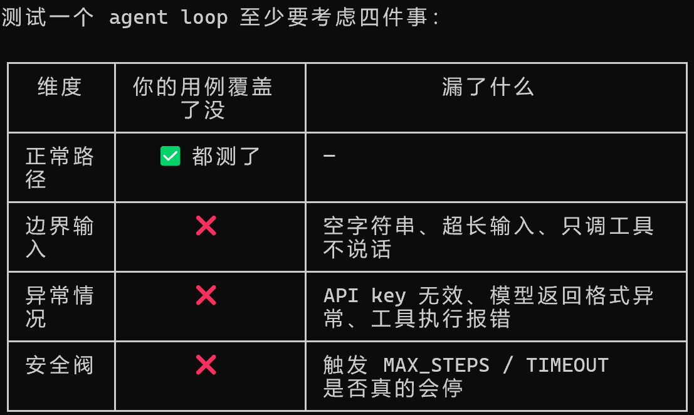

Agent 学习笔记

## L0

### 1. Agent vs Workflow

- **Agent**：没有那么多细节的要求，更多的是像人一样思考。
- **Workflow**：is constructed to be a flow —— 规定好的一个流程，有输入输出、特定不可更改，不需要去思考有没有更好的方法。

### 2. Agent Circle

**Observe → Think → Act → 循环**

- **Observe** 负责：接收外部指令
- **Think** 负责：思考，它要变成什么样才符合要求（更快速、更优化……），基于当前信息做决策
- **Act** 负责：实施，真正去执行这个思考

循环终止条件：

- 任务完成，用户满意
- Agent 判断没有可改进的空间
- 达到预设最大步数
- 遇到无法恢复的错误

### 3. 什么时候不用 Agent

| 场景 | 原因 |
| --- | --- |
| 图文分离的简单多模态任务 | agent 会搞得很复杂，增加不确定性 |
| 固定格式表格 / 数据处理 | 输入输出完全确定，脚本即可，agent 可能偏离预期格式 |
| 机密内容 | 可能导致泄露 |
| 实时性要求极高的操作 | Agent 循环多次往返有延迟，不适合高频交易、实时控制等场景 |

### 4. Agent Loop

```
while True:
    1. 问模型"现在做什么？"
    2. 模型说"调工具 X，参数是 Y"——你去执行
    3. 把执行结果喂给模型，回到第 1 步
    直到模型说"做完了，答案是 Z"——退出
```

## L1

### 5. Step vs Tool Call Count

- step 是调用 LLM 的次数
- tool call count 是调用工具的次数
- 工具是自带的，调用 API 的次数才是统计成本的方式

### 6. Append Assistant

```
消息1: user      → "查北京天气"
消息2: assistant → "我要调 get_weather，tool_call_id=abc" ← msg
消息3: tool      → "北京：5°C"（tool_call_id=abc）← 必须跟在 msg 后面
```

API 看到消息3时，会往前找：哪个 assistant 消息声明过 `tool_call_id=abc`？找到消息2，匹配成功。

换句话说，`tool_calls` 不是外部系统发来的，它就是模型的"回答"——一种特殊的回答。所以整个对话链条永远是：

user 问 → assistant 答/调工具 → tool 返回结果 → assistant 再答

assistant 永远是说话的那一方，tool 只是替它跑腿。

### 7. 测试用例

单工具 / 多工具 / 无工具



### 8. 相同点 vs 不同点（对比 Claude Code）

**相同点：**

1. 都是同样的循环模式：用户输入 → 模型决策 → 调工具 → 结果喂回 → 再问模型 → 直到模型说停
2. 工具都通过 schema（name / description / parameters）提前告知模型，模型通过 function calling 选择调哪个

**不同点：**

1. **工具数量**：你的 agent 只有 2 个固定工具，Claude Code 有几十个（文件读写、搜索、shell、web fetch 等），工具系统可以动态扩展
2. **权限控制**：你的 agent 任何工具都直接执行（eval 说跑就跑），Claude Code 分三层——有的静默执行、有的弹确认框、有的直接拒绝

### 9. README 文件到底是干啥的

就两个作用：

1. 别人打开你的项目能跑起来——装什么依赖、配什么环境变量、运行哪个命令、预期看到什么输出
2. 你自己一个月后回来看还能跑起来——不然你早忘了 DeepSeek API key 怎么配的了

比如你这个 L1 给别人，没有 README 的话，他打开 `main.py` 看到 `from openai import OpenAI` 就迷糊了——用的不是 OpenAI 是 DeepSeek 啊？key 从哪来？装了哪些包？

README 就是项目的"说明书"，不写你就是项目唯一的用户，写了对别人（和将来的你）才有可用性。

## L2

### 
